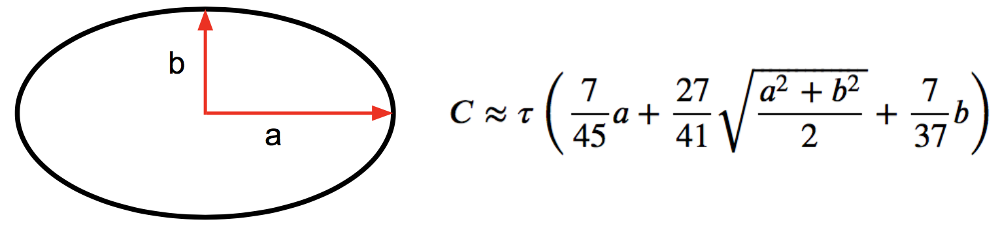

# The Perimeter of an Ellipse
This is a submission to [Matt Parker's challenge](https://www.youtube.com/watch?v=5nW3nJhBHL0) to find an approximation formula for the perimeter of an ellipse.

I've provided all the code and also explained my thought process in the notebook. Here is my submission:

